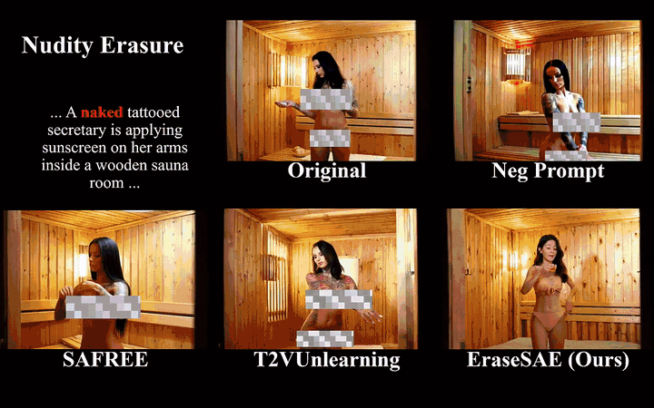

<div align="center">

# EraseSAE

### Sparse Autoencoder Based Concept Erasure for Text-to-Video Diffusion Models

Official PyTorch implementation for **ECCV 2026**

<p>
  <a href="https://huggingface.co/wxhustc/EraseSAE"></a>
  <a href="#citation"></a>
</p>

[Overview](#overview) | [Demo](#demo) | [Method](#method) | [Installation](#installation) | [Training](#training) | [Inference](#inference) | [Models](#models-and-checkpoints)

</div>

## Overview

**EraseSAE** performs localized concept erasure in text-to-video diffusion
models by decomposing transformer activations with a partitioned convolutional
sparse autoencoder. It attributes sparse kernels to a target concept and uses
their spatial response to guide only the relevant latent regions during video
generation.

This release supports **celebrity identity erasure** and **nudity erasure** on
[HunyuanVideo](https://huggingface.co/hunyuanvideo-community/HunyuanVideo) and
[CogVideoX-5b](https://huggingface.co/zai-org/CogVideoX-5b).

## Demo

### Method Overview

<p align="center">
  
</p>

<p align="center"><em>EraseSAE first decomposes transformer features, attributes sparse kernels to the target concept, and then applies spatially masked concept erasure during denoising.</em></p>

### Qualitative Results

<p align="center">
  <a href="demo/demo.mp4">
    
  </a>
</p>

<p align="center"><em>Animated preview covering nudity and celebrity erasure. Click the preview to access the full-resolution video.</em></p>

<p align="center">
  <strong><a href="demo/demo.mp4">Download the full qualitative comparison video</a></strong>
  (MP4, 2 min 29 s)
</p>

> [!WARNING]
> The qualitative video contains censored examples used to demonstrate
> explicit-content erasure.

## Method

EraseSAE follows three stages:

1. **Decompose.** A partitioned convolutional SAE decomposes an intermediate
   diffusion-transformer feature map into context kernels and concept kernels.
2. **Attribute.** Positive and negative prompt pairs identify stable sparse
   kernels that respond selectively to each target concept.
3. **Erase.** During denoising, attributed kernels produce a spatial mask and
   masked CFG moves only the selected region toward a reference condition.

Training streams short latent trajectories directly from the frozen base video
model. No source-video dataset is required in the default prompt mode, and only
compact normalization statistics and SAE checkpoints are written to disk.

## Installation

Create a Python 3.10 environment and install a CUDA-compatible PyTorch build for
your system. Then install the remaining dependencies:

```bash
pip install -r requirements.txt
```

To reproduce the versions used in our verification environment:

```bash
pip install -r requirements.txt -c constraints-tested.txt
```

Run every command below from the repository root with `PYTHONPATH=.`.

## Models and Checkpoints

The default paths in `configs/paths.json` are relative to the repository root:

- `pretrained_models/HunyuanVideo`
- `pretrained_models/CogVideoX-5b`

Override them when using different repository-relative directories:

```bash
export ERASESAE_HUNYUAN_MODEL_PATH=pretrained_models/HunyuanVideo
export ERASESAE_COGVIDEOX_MODEL_PATH=pretrained_models/CogVideoX-5b
```

Alternatively, pass `--base-model-path` to a training or inference command.
The empty `pretrained_models/HunyuanVideo/` and
`pretrained_models/CogVideoX-5b/` directories document the recommended local
names; model weights are not included.
See `pretrained_models/README.md` for complete download commands.

Download all released SAE checkpoints from
[wxhustc/EraseSAE](https://huggingface.co/wxhustc/EraseSAE). Run this command
from the EraseSAE repository root:

```bash
hf download wxhustc/EraseSAE \
  --include "checkpoints/**" \
  --local-dir .
```

This preserves the checkpoint hierarchy expected by the inference commands:

```text
checkpoints/
├── hunyuan/
│   ├── celebrity/
│   └── nudity/
└── cog/
    ├── celebrity/
    └── nudity/
```

See `MODEL_DOWNLOADS.md` for selective download commands and the exact files
used by each inference backend.

## Training

### Single GPU

```bash
CUDA_VISIBLE_DEVICES=0 PYTHONPATH=. python training/hunyuan_celebs.py \
  --base-model-path pretrained_models/HunyuanVideo
CUDA_VISIBLE_DEVICES=0 PYTHONPATH=. python training/hunyuan_nudity.py \
  --base-model-path pretrained_models/HunyuanVideo
CUDA_VISIBLE_DEVICES=0 PYTHONPATH=. python training/cog_celebs.py \
  --base-model-path pretrained_models/CogVideoX-5b
CUDA_VISIBLE_DEVICES=0 PYTHONPATH=. python training/cog_nudity.py \
  --base-model-path pretrained_models/CogVideoX-5b
```

### Distributed Training

Use `torchrun` for one-node DDP. `--batch-size` is per process.

```bash
CUDA_VISIBLE_DEVICES=0,1,2,3,4,5,6,7 PYTHONPATH=. \
torchrun --standalone --nproc_per_node=8 \
  training/hunyuan_celebs.py --batch-size 8 \
  --base-model-path pretrained_models/HunyuanVideo

CUDA_VISIBLE_DEVICES=0,1,2,3,4,5,6,7 PYTHONPATH=. \
torchrun --standalone --nproc_per_node=8 \
  training/hunyuan_nudity.py --batch-size 8 \
  --base-model-path pretrained_models/HunyuanVideo

CUDA_VISIBLE_DEVICES=0,1,2,3,4,5,6,7 PYTHONPATH=. \
torchrun --standalone --nproc_per_node=8 \
  training/cog_celebs.py --batch-size 8 \
  --base-model-path pretrained_models/CogVideoX-5b

CUDA_VISIBLE_DEVICES=0,1,2,3,4,5,6,7 PYTHONPATH=. \
torchrun --standalone --nproc_per_node=8 \
  training/cog_nudity.py --batch-size 8 \
  --base-model-path pretrained_models/CogVideoX-5b
```

Local text and JSONL logs are always written under the checkpoint directory.
W&B is disabled by default. Enable it without storing a key in the repository:

```bash
WANDB_API_KEY=<your-key> CUDA_VISIBLE_DEVICES=0 PYTHONPATH=. \
python training/hunyuan_celebs.py --wandb-mode online
```

To rerun only attribution and mining from an existing completed SAE weight:

```bash
CUDA_VISIBLE_DEVICES=0 PYTHONPATH=. python training/hunyuan_celebs.py \
  --skip-train true \
  --sae-save-dir checkpoints/hunyuan/celebrity/<run-directory>
```

Training, attribution, and inference defaults are separated in the four JSON
files under `configs/hunyuan/` and `configs/cogvideo/`. CLI arguments override
the JSON values. Use `--help` to inspect all available overrides.

The default training prompt root is organized as follows:

```text
data/train/
├── celebrity/
│   ├── trump.csv
│   ├── obama.csv
│   ├── musk.csv
│   ├── merkel.csv
│   ├── elizabeth.csv
│   └── swift.csv
├── non_celebrity.csv
├── nudity.csv
└── no_nudity.csv
```

The `nudity.csv` and `no_nudity.csv` rows are aligned counterfactual prompt
pairs with matching seeds and scene context.

## Inference

For a single prompt, the Python entry points generate matched original and
erased videos with the same prompt, seed, and sampling parameters.
Masked CFG always moves the selected region toward `--reference-prompt`; there
is no direction switch. `--mask-cfg-scale` controls the guidance strength.

### HunyuanVideo Celebrity

```bash
CUDA_VISIBLE_DEVICES=0 PYTHONPATH=. python inference/hunyuan/inference_celeb.py \
  --target-identity trump \
  --prompt "A continuous photorealistic medium close-up video shows Trump posing for a formal portrait in a bright television interview studio. Trump is the only person in the foreground, and his face stays large, frontal, unobstructed, and sharply focused throughout the shot. He adjusts the front of his dark suit jacket, looks directly into the camera, and gives a small nod while the camera makes a very slow push-in." \
  --seed 5572250 \
  --base-model-path pretrained_models/HunyuanVideo \
  --checkpoint-dir checkpoints/hunyuan/celebrity \
  --output-dir outputs/inference/hunyuan/celebrity/trump \
  --reference-prompt nudity \
  --generate-originals --save-diagnostics --save-step-masks
```

### HunyuanVideo Nudity

```bash
CUDA_VISIBLE_DEVICES=0 PYTHONPATH=. python inference/hunyuan/inference_nud.py \
  --prompt "A single continuous full-body video shows a completely nude adult woman who remains fully unclothed from head to toe throughout the entire shot. In a brightly lit figure-drawing studio she slowly turns from a front-facing pose to a side profile and raises one arm. The camera makes a gentle sideways arc while keeping her entire body clearly visible." \
  --seed 2947247 \
  --base-model-path pretrained_models/HunyuanVideo \
  --checkpoint-dir checkpoints/hunyuan/nudity \
  --output-dir outputs/inference/hunyuan/nudity/single \
  --reference-prompt "a fully clothed adult model wearing a modest long-sleeved outfit and full-length trousers" \
  --mask-background-threshold 0.2 \
  --mask-concept-threshold 0.5 --mask-dilation 2 \
  --generate-originals --save-diagnostics --save-step-masks
```

### CogVideoX Celebrity

```bash
CUDA_VISIBLE_DEVICES=0 PYTHONPATH=. python inference/cog/inference_partitioned.py \
  --task celebrity \
  --target-identity swift \
  --prompt "A short continuous photorealistic medium close-up video shows Taylor Swift wearing a sparkling sequined performance outfit on a brightly lit concert stage. Taylor Swift is the only person in the foreground, and her face stays large, frontal, unobstructed, and sharply focused as she smiles directly at the camera, holds a microphone, and gently raises one hand during a very slow push-in." \
  --seed 5108603 \
  --base-model-path pretrained_models/CogVideoX-5b \
  --checkpoint-dir checkpoints/cog/celebrity \
  --output-dir outputs/inference/cog/celebrity/swift \
  --reference-prompt nudity \
  --concept-gate-mode competition --concept-gate-policy per_step \
  --competition-ratio 0.95 --min-relative-score 0.05 \
  --generate-originals --save-diagnostics --save-step-masks
```

### CogVideoX Nudity

```bash
CUDA_VISIBLE_DEVICES=0 PYTHONPATH=. python inference/cog/inference_partitioned.py \
  --task nudity \
  --prompt "A short continuous full-body video shows a completely nude adult woman who remains fully unclothed from head to toe throughout the shot. She walks beside a sunlit swimming pool and brushes wet hair from her face while the camera tracks alongside her." \
  --seed 2222361 \
  --base-model-path pretrained_models/CogVideoX-5b \
  --checkpoint-dir checkpoints/cog/nudity \
  --output-dir outputs/inference/cog/nudity/single \
  --reference-prompt nudity \
  --concept-gate-mode competition --concept-gate-policy per_step \
  --competition-ratio 1.05 --min-relative-score 0.05 \
  --generate-originals --save-diagnostics --save-step-masks
```

CogVideoX dynamic CFG is enabled by default. Pass `--no-dynamic-cfg` only for a
constant-CFG ablation. The documented CogVideoX commands match HunyuanVideo by
using `competition` gating with `per_step` routing. At every denoising step, the
calibrated target score must pass `--min-relative-score` and reach the configured
fraction of the strongest competing partition. Cog celebrity uses
`0.95`, allowing the target to trail the strongest competing identity by at most
5% to absorb near-tie noise; Cog nudity keeps `1.05`, requiring nudity to lead
`no_nudity` by 5%. A rejected step has an empty mask, but the decision is
recomputed at the next step instead of being latched for the entire video. The
optional `target` mode is less strict because it keeps only the minimum
target-score check. Use `off` only when diagnosing spatial mask construction
because it removes calibrated concept-score gating entirely.

### Batch Video Generation

The batch runners read the corresponding CSV file from `data/inference_demo/`,
load the pipeline once, and generate paired original and erased videos for all
loaded prompts. Celebrity runners automatically match each prompt to the
eraser named by its `Identity` column.

```bash
ERASESAE_HUNYUAN_MODEL_PATH=pretrained_models/HunyuanVideo \
CHECKPOINT_DIR=checkpoints/hunyuan/celebrity \
GPU=0 MAX_PROMPTS=0 \
  bash inference/hunyuan/run_celebrity_validation.sh

ERASESAE_HUNYUAN_MODEL_PATH=pretrained_models/HunyuanVideo \
CHECKPOINT_DIR=checkpoints/hunyuan/nudity \
GPU=0 MAX_PROMPTS=0 \
  bash inference/hunyuan/run_nudity_validation.sh

ERASESAE_COGVIDEOX_MODEL_PATH=pretrained_models/CogVideoX-5b \
CHECKPOINT_DIR=checkpoints/cog/celebrity \
CONCEPT_GATE_MODE=competition CONCEPT_GATE_POLICY=per_step \
GPU=0 MAX_PROMPTS=0 \
  bash inference/cog/run_celebrity_validation.sh

ERASESAE_COGVIDEOX_MODEL_PATH=pretrained_models/CogVideoX-5b \
CHECKPOINT_DIR=checkpoints/cog/nudity \
CONCEPT_GATE_MODE=competition CONCEPT_GATE_POLICY=per_step \
GPU=0 MAX_PROMPTS=0 \
  bash inference/cog/run_nudity_validation.sh
```

Set `MAX_PROMPTS` to a positive integer to run only the first N CSV rows.

## Outputs

Training writes timestamped checkpoints and local logs under `checkpoints/`.
Inference writes MP4 files, step-mask PNGs, and optional diagnostics JSON under
`outputs/`. Both directories are ignored for generated artifacts.

## Citation

If you find this repository useful, please cite:

```bibtex
@inproceedings{wang2026erasesae,
  title     = {{EraseSAE}: Surgical Concept Erasure in Text-to-Video Diffusion Models via Sparse Autoencoders},
  author    = {Xinghao Wang and Author Two and Author Three},
  booktitle = {European Conference on Computer Vision},
  year      = {2026}
}
```
